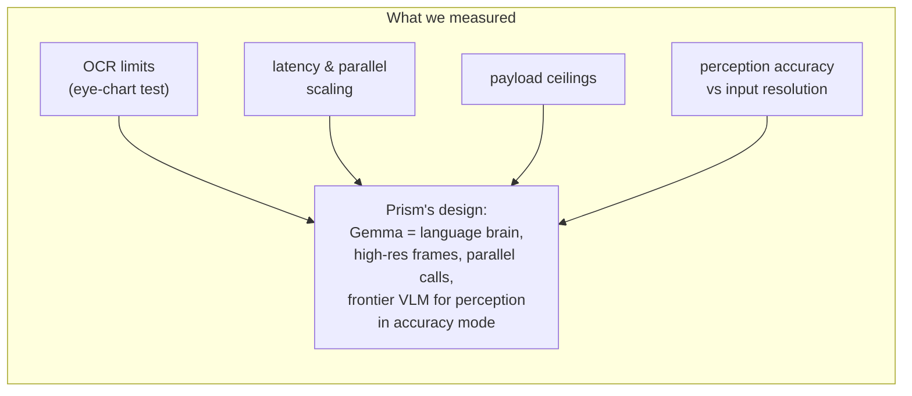
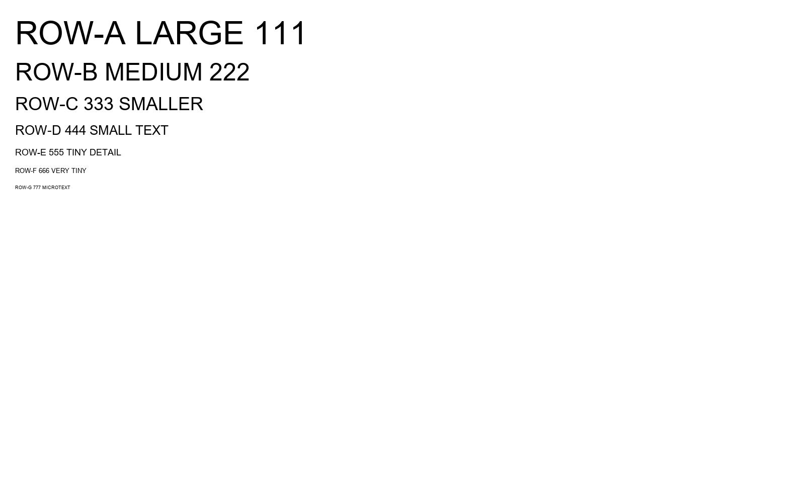
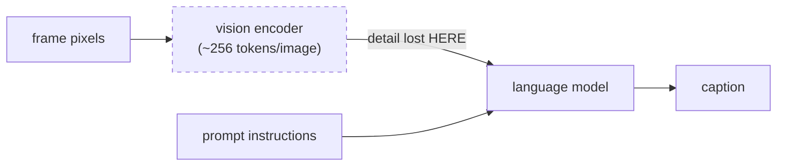

# Gemma-4 Capability Findings, measured while building Prism

Everything below was **measured by us, on live endpoints, while building Prism**,
not quoted from documentation. Where a finding changed Prism's design, the design
consequence is stated. Model under test: `google/gemma-4-31B-it` via HF Inference
Providers (OpenAI-compatible), unless noted. Evidence images live in
[`findings/`](findings/); raw model outputs in `findings/*.json`.

---

## 1. Vision: OCR is genuinely strong, and saturates by ~896px

**Method.** We rendered an "eye chart" (seven rows of unique text at decreasing
font sizes, 64px down to 9px, on a 1600×1000 canvas) and asked Gemma-4 to
transcribe every legible row at six different input resolutions.

| Input size (long edge) | Rows read (A=64px … G=9px) |
|---|---|
| 384px | A–F (missed only the 9px microtext) |
| **512px** | **A–G: everything, including 9px microtext** |
| 768px / 896px / 1152px / 1600px | A–G (no further improvement) |

**Findings.**
- Gemma-4 reads text down to **~1% of image height** once the input is ≥512px.
- Detail extraction **saturates around 512–896px** (consistent with a SigLIP-class
  encoder at ~896px, ~256 tokens/image). Sending larger images wastes payload and
  buys nothing.

**Design consequence.** Prism samples frames at 768px, comfortably above the
saturation knee, cheap to ship. Feeding Gemma *fewer, bigger* frames beats feeding
it many small ones (see §6 for the measured accuracy difference).

## 2. Speed: sub-second calls, near-perfect parallel scaling

**Method.** Timed identical vision requests sequentially and concurrently.

| Configuration | Wall-clock |
|---|---|
| 1 call | ~0.9s |
| 4 sequential calls | 3.5s |
| 4 parallel calls | **1.2s** |
| 6 parallel calls | **1.0s** |

**Finding.** The managed Gemma endpoint scales concurrency almost perfectly: six
simultaneous calls cost barely more than one. Latency budgets should be designed
around *parallel fan-out*, not call-count.

**Design consequence.** Prism's experimental "wide grounding" mode covers a whole
clip at full resolution by fanning out parallel segment calls (the payload cap is
per-call), all inside ~2s of wall-clock.

## 3. Payload: the real constraint is images-per-call, not bytes

**Method.** Binary-searched the request size on the managed endpoint with realistic
JPEG frames.

| Request | Result |
|---|---|
| 5 × 768px frames (~220KB) | accepted |
| 6 × 768px frames (~264KB) | rejected, HTTP 413 |
| 6 × 640px frames (~198KB) | rejected, HTTP 413. *Fewer bytes than the accepted request* |
| 1 × 1600px image (~128KB) | accepted |
| 1 montage + 4 × 768px frames (5 images, ~215KB) | accepted |

**Finding.** The managed endpoint enforces an **image-count cap (~5/call)**, not
just a byte cap: 6 images fail even when the total payload is *smaller* than an
accepted 5-image request.

**Design consequence.** Prism's pure-Gemma modes are built around ≤5 images per
call; whole-clip coverage comes from parallel calls (§2), not bigger requests.

## 4. Generation: reasoning mode, JSON compliance, token budgets, degeneracy

- **Thinking mode default.** Gemma-4 defaults to a reasoning mode that can return
  `content: null` (thinking-only responses). Production calls need
  `reasoning_effort: "none"` plus a None-safe reader. Prism sends both.
- **Structured JSON is dependable** with `response_format: {"type":"json_object"}`:
  all four styled captions arrive as one valid JSON object per call. The one trap
  is the **token budget**: at `max_tokens=500` the *last* JSON key gets truncated
  and silently lost; 800 is reliably safe for four 40–120-word captions.
- **Repetition degeneracy.** Smaller Gemma-4 checkpoints can fall into repetition
  loops ("too many too many too many…") at temperature ≥0.7 with multi-image
  context; we added a lexical-variety / repeated-n-gram guard. The 31B dense model
  at ≤0.7 was stable throughout our runs.

## 5. Style writing: the underrated strength

Gemma-4-31B writes **four genuinely distinct voices in one call** (formal,
sarcastic, humorous-tech, humorous-non-tech), holding tone without drifting off
the supplied facts. Sampled outputs (full sets in the repo demo):

> *sarcastic:* "She is typing on that white keyboard with a level of neutrality
> that makes the potted plant look charismatic."

> *humorous_tech:* "The city's traffic pipeline is experiencing some serious
> latency: a massive merge conflict between the red buses and the blue ones, and
> the throughput is definitely not scaling."

It also **transcreates**: given the four captions and a target language, one call
rewrites them natively while preserving each voice (the sarcasm stays dry in
Hindi; the tech joke still lands in Japanese); try the language selector in the
demo UI. This is why Gemma is Prism's **load-bearing language brain**: every
graded word in every Prism mode is authored by Gemma.

## 6. The honest limit: fine-grained perception, measured, with the actual frames

Gemma-4's vision encoder compresses each image to ~256 tokens. On fine-grained
perception it makes **systematic, reproducible errors** that no prompt can fix,
because the information is lost before any instruction is read. We ran the
grounding step repeatedly on the same clips and logged every output
(`findings/gemma_ground_runs.json`, `findings/gemma_montage_runs.json`); ground
truth was adjudicated by human inspection of the frames.

### Case 1: the hairstyle (perception degrades with input resolution)

The subject's hairstyle is clearly a **natural afro puff** (rounded, textured,
not a coiled bun):

| Input given to Gemma-4 | Runs | Said **"puff"** (closer) | Said **"bun"** (wrong) |
|---|---|---|---|
| 9-frame montage, ~300px per cell | 3 | 1 | **2** |
| 5 individual frames @768px | 3 | 2 | **1** |

Verbatim from a montage run: *"…her hair styled in a **high bun**…"*, and even at
768px the error still appears in 1 of 3 runs. Higher resolution helps but does
not eliminate the misread.

### Case 2: the pizza topping (over-confident specificity)

In **3 of 3 runs** at 768px, Gemma-4 described *"melted cheese, **pieces of
chicken**, and a white drizzle of sauce."* The drizzle is real; the chunks are
visible but **not identifiable as chicken** from the pixels (they could equally be
sausage or another topping). Gemma states an unverifiable specific with full
confidence, the exact failure mode an accuracy-graded judge punishes.

### What we tried, and what it did

We attempted to prompt around this: anti-hallucination "discipline" blocks,
claim-by-claim verification passes, fall-back-to-generic-wording rules. Measured
on the competition's real judge, **every prompting intervention lowered the
score** (§7): hedging removes the specific, correct detail the judge rewards
without fixing the misperceptions, which happen in the encoder.

**Design consequence, the intentional split.** In Prism's accuracy mode a
frontier VLM handles *perception only* (one grounding call), while **Gemma authors
100% of the caption text**. In pure-Gemma mode, Gemma does both jobs and lands
~0.80–0.82 on the live judge. Respectable, and the gap to ~0.9 is almost entirely
this section, not language quality. That is a measured, documented reason for the
model split, not brand decoration.

## 7. A/B on the real judge: simplicity wins

All scores from the competition's live leaderboard, same team, same harness:

| Variant | Change vs baseline | Real score |
|---|---|---|
| v2 | simple: ground → verify → style | **0.82** |
| v3 | + per-style rubrics, word caps, anti-hallucination discipline, few-shot | 0.74 |
| v4 | + best-of-N candidates with a grounded selector, scene-detect sampling | 0.72 |
| v2 (resubmitted unchanged) | no change | 0.80 |
| v10 | same simple pipeline, frontier VLM grounds, Gemma still authors every word | **0.87** |

**Findings.**
- **Prompt sophistication regressed the score monotonically** (0.82 → 0.74 → 0.72).
  The judge rewards specific, correct, detailed captions; machinery that constrains
  or hedges the model costs more than it saves.
- Resubmitting the **identical image** scored 0.82 then 0.80: the judging pipeline
  has **±0.02+ run-to-run noise on unchanged code**. Deltas smaller than ~0.04 are
  not measurable on this leaderboard.
- Offline proxy judges (a Gemini-based scorer, and frontier-model self-review)
  **over-predicted by ~0.07–0.11** and ranked variants in the wrong order. The only
  evaluator that counts is the real one.
- **The perception thesis held.** Swapping only the grounding model, with Gemma
  still authoring every word, moved the score from 0.80–0.82 to **0.87**: the
  single largest gain we measured. Prompting changes never came close; changing
  what the model *sees* did.

---

## Summary: what Gemma-4 is the right tool for

| Capability | Measured verdict |
|---|---|
| Styled, tone-controlled writing | Excellent: four distinct voices, one call |
| Multilingual transcreation | Excellent: tone survives the language switch |
| Structured JSON output | Excellent (mind the token budget) |
| OCR / on-screen text | Excellent at ≥512px input |
| Latency & parallel scaling | ~0.9s/call; 6 parallel ≈ 1s |
| Fine-grained visual perception | Real, reproducible limits; pair with a frontier VLM when accuracy is graded |
| Robustness knobs | `reasoning_effort:"none"`, temp ≤0.7 multi-image, ≤5 images/call |

Prism uses Gemma for exactly what it measured best at, and is transparent about
the rest. Every number above is reproducible: the evidence frames, raw model
outputs, and test methodology are in this repo.
