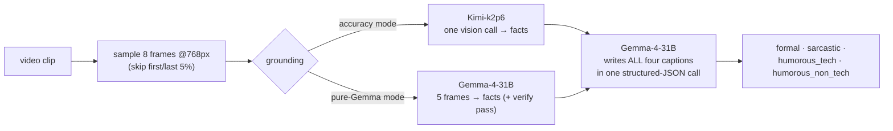

# Prism: one clip, four voices, one Gemma brain

Prism is a video-captioning agent built for the **AMD Developer Hackathon ACT II, Track 2**.
It refracts a single video into four audience-tuned captions (**formal, sarcastic,
humorous-tech, humorous-non-tech**) like a prism splitting light. Every graded word is
authored by **Google's Gemma-4-31B**: it writes all four voices in a single structured-JSON
call, holds tone without drifting off-facts, and scales to six concurrent calls in about a
second. We chose Gemma deliberately, and we can prove why, because we **measured** it. Our
[**GEMMA_FINDINGS**](GEMMA_FINDINGS.md) report documents where Gemma-4 excels (9-pixel OCR at
≥512px inputs, sub-second latency, near-perfect parallel scaling, dependable JSON output,
genuinely good stylistic writing) and where its vision encoder hits real limits. That is
exactly why, in our accuracy mode, a frontier vision model handles *perception only* while
**Gemma remains the load-bearing language brain that crafts 100% of the captions**. No fake
branding: this repo shows precisely what each model does.

> *"A whole, pre-sliced pizza with a golden-brown crust… a hand sprinkles parmesan across the surface."* (**formal**)
> *"Applying a hotfix of parmesan to the production environment, hopefully without crashing the crust."* (**tech-humor**)

---

## Who does what (the honest model-role table)

| Role | Model | Notes |
|---|---|---|
| **Caption authorship: every graded word, all four styles** | **Gemma-4-31B-it** | One structured-JSON call, `reasoning_effort:"none"`, temp 0.7 |
| Perception / grounding (accuracy mode, default) | Kimi-k2p6 (Fireworks serverless) | One call over 8 × 768px frames; reports facts only, writes nothing the judge sees |
| Perception / grounding (pure-Gemma mode) | Gemma-4-31B-it | 5 × 768px frames (the managed endpoint's per-call image cap) |
| Failover styling | Gemma-4 via Fireworks → Gemma-3 (AMD-hosted) | 3-tier chain; retries on transient errors |

Why the split? Gemma-4's vision encoder has measurable perception limits (it read an afro
puff as a "high bun"; no prompt can recover what the encoder never extracted; see
[GEMMA_FINDINGS §6](GEMMA_FINDINGS.md), evidence frames included). Pairing Gemma with a
frontier model *for perception only*, while Gemma authors every word, is a documented,
intentional engineering decision, not brand decoration. Set no `FIREWORKS_API_KEY` and Prism
runs **pure-Gemma end to end**.

## How it works



*Ground once, restyle four ways*: one factual description keeps every caption faithful to the
same facts while each voice lands its own tone. The pipeline is deliberately simple, two
model calls per clip, because we A/B-tested sophistication on the live judge and **simple
won** (rubric machinery and best-of-N selection measurably lowered the real score; the full
experiment log is in [GEMMA_FINDINGS §7](GEMMA_FINDINGS.md)).

Reliability is the floor: results are pre-seeded with valid in-style fallbacks and rewritten
atomically after every clip, so a crash or timeout can never zero the run.

---

## Quick start

### Run the published image (exactly what the grader runs)
The container reads `/input/tasks.json` and writes `/output/results.json`:
```bash
# tasks.json: [{ "task_id": "v1", "video_url": "https://…mp4",
#                "styles": ["formal","sarcastic","humorous_tech","humorous_non_tech"] }]
docker run --rm -v "$PWD/input:/input" -v "$PWD/output:/output" ghcr.io/devdebojyotic/prism:latest
```

### Run locally
```bash
pip install -r requirements.txt
# create a .env:
#   HF_TOKEN=hf_xxx                          # Gemma-4 via HF Inference Providers
#   HF_GEMMA_MODEL=google/gemma-4-31B-it
#   FIREWORKS_API_KEY=fw_xxx                 # optional: enables the Kimi grounding mode
PRISM_INPUT=test/sample_tasks.json PRISM_OUTPUT=output/results.json python main.py
```

### Demo frontend (the interactive walkthrough)
```bash
uvicorn serve:app --port 8001          # backend API
cd web && npm install && npm run dev   # frontend at http://localhost:3000
```

---

## Project structure

| File | Purpose |
|---|---|
| `main.py` | Entry point: reads `/input/tasks.json`, writes `/output/results.json` |
| `video.py` | Download + high-res individual frame sampling |
| `caption.py` | Ground-once-restyle-four + the demo title helper |
| `styles.py` | The four caption styles (definitions + examples) |
| `gemma_client.py` | Gemma-4 client (3-tier failover) + the Kimi grounding call |
| `GEMMA_FINDINGS.md` | **Measured Gemma-4 capability research**: OCR limits, scaling, payload caps, real-judge A/Bs |
| `transcribe.py` | Optional local audio transcription (off by default) |
| `serve.py` | FastAPI demo backend |
| `web/` | Next.js demo frontend |
| `Dockerfile` | Builds the submission image (`python main.py`) |

See [`documentation.md`](documentation.md) for a function-level reference.

---

## Roadmap: deeper into the Gemmaverse

Prism already uses two family members (Gemma-4-31B for authorship, EmbeddingGemma for
the demo's fact-anchor check). The family has obvious next steps:

- **Audio-input Gemma.** Prism currently discards the soundtrack. Gemma's audio-capable
  models could ground on commentary, crowd noise, or UI clicks in screen recordings,
  the extension most likely to lift accuracy further. We probed this during the
  hackathon: the Gemma-4 audio checkpoints (12B, E4B) have no serverless provider
  today, but Gemma 3n E4B does accept audio through one hosted endpoint (with a
  format quirk: audio_url, not input_audio), and the demo's experimental
  "soundtrack" row uses exactly that. The small checkpoint hears ambient audio
  unreliably, which is why the graded pipeline does not use it yet; the larger
  audio checkpoints are the real target.
- **ShieldGemma 2.** For brands publishing four-voice captions at scale, a safety pass
  over the humorous outputs before they ship.
- **Indic-language depth.** Navarasa (Telugu-LLM-Labs' Gemma fine-tune for Indic
  languages) shows where transcreation can go; Prism's selector already covers Hindi,
  Bengali, Telugu, and Tamil.
- **Live word-synced captions (experimental, parked).** We prototyped subtitles
  rendered over the source video in sync with playback, driven by timestamped
  transcription. Utterance-level timing worked; word-level sync needs a
  word-timestamp ASR, so the feature is parked until the Gemma family exposes
  one. The transcript itself ships today in the demo's Transcript tab.
- **A Gemma voice (shipped in the demo).** The "listen" button speaks with
  T5Gemma-TTS, a community TTS built on Google's T5Gemma weights, running on a HF
  ZeroGPU Space (the only live Gemma-family voice: none of the 35 Gemma-TTS models
  on the Hub has a serverless provider today; we checked every one). The browser's
  speech engine covers failures and quota. Next step: self-host it beside Prism.
- **On-device Prism.** Open weights make the endgame local and private: small Gemma
  checkpoints captioning on the machine that recorded the video.

## Notes
- **Graded submission images:** `v10-scored` tag = the 0.87 run (quick 8-frame
  grounding). `v11-scored` tag = the current head, which enables the flow-montage
  grounding (`PRISM_FLOW=1`) and speech-aware grounding (`PRISM_STT=1`) inside
  the image; both flags revert at runtime, and timing guards keep 4K clips under
  the 30s budget. Everything else in later commits is demo and documentation.
- Track 2 injects no credentials, so model tokens are baked into the public image at build
  time. If you fork this, use disposable tokens and rotate them afterwards.
- Built for `linux/amd64`; CPU-only; ~10–20s per clip, well within the 30 s/clip and 10 min budgets.

## License
[MIT](LICENSE)
