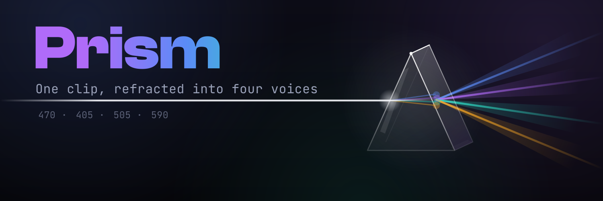
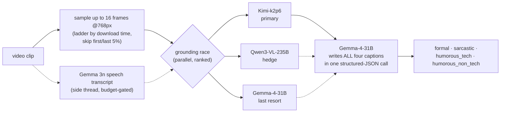

<p align="center">
  
</p>

# Prism: one clip, four voices, one Gemma brain

Prism is a video-captioning agent built for the **AMD Developer Hackathon ACT II, Track 2**.
It refracts a single video into four audience-tuned captions (**formal, sarcastic,
humorous-tech, humorous-non-tech**) like a prism splitting light. Every graded word is
authored by **Google's Gemma-4-31B**: it writes all four voices in a single structured-JSON
call, holds tone without drifting off-facts, and scales to six concurrent calls in about a
second. We chose Gemma deliberately, and we can prove why, because we **measured** it. Our
[**GEMMA_FINDINGS**](GEMMA_FINDINGS.md) report documents where Gemma-4 excels (9-pixel OCR at
≥512px inputs, sub-second latency, near-perfect parallel scaling, dependable JSON output,
genuinely good stylistic writing) and where its vision encoder hits real limits. That is
exactly why, in our accuracy mode, a frontier vision model handles *perception only* while
**Gemma remains the load-bearing language brain that crafts 100% of the captions**. No fake
branding: this repo shows precisely what each model does.

> *"A whole, pre-sliced pizza with a golden-brown crust… a hand sprinkles parmesan across the surface."* (**formal**)
> *"Applying a hotfix of parmesan to the production environment, hopefully without crashing the crust."* (**tech-humor**)

---

## Who does what (the honest model-role table)

| Role | Model | Notes |
|---|---|---|
| **Caption authorship: every graded word, all four styles** | **Gemma-4-31B-it** | One structured-JSON call, `reasoning_effort:"none"`, temp 0.7 |
| Perception / grounding, primary | Kimi-k2p6 (Fireworks serverless) | Up to 16 × 768px frames (a download-time ladder: 16/13/10/8); reports facts only, writes nothing the judge sees |
| Perception / grounding, parallel hedge | Qwen3-VL-235B (HF router) | Races alongside Kimi; its answer is used only if Kimi fails |
| Perception / grounding, last resort | Gemma-4-31B-it | Third lane of the same race; also the whole pipeline in pure-Gemma mode (no `FIREWORKS_API_KEY`) |
| Speech transcription (budget-gated) | Gemma 3n E4B | Side-thread transcript feeds the grounding when the clock allows |
| Failover styling | Gemma-4 across four serverless hosts | Provider-pinned failover with per-clip deadlines; retries on transient errors |

The three grounding lanes fire **in parallel** and the pipeline keeps the best-ranked answer
that succeeded, so a provider outage degrades quality by one rung instead of zeroing a clip.
Every model call carries an absolute per-clip deadline, and a hard cutoff guarantees the
30s/clip budget on any input.

Why the split? Gemma-4's vision encoder has measurable perception limits (it read an afro
puff as a "high bun"; no prompt can recover what the encoder never extracted; see
[GEMMA_FINDINGS §6](GEMMA_FINDINGS.md), evidence frames included). Pairing Gemma with a
frontier model *for perception only*, while Gemma authors every word, is a documented,
intentional engineering decision, not brand decoration. Set no `FIREWORKS_API_KEY` and Prism
runs **pure-Gemma end to end**.

## Running on AMD


Prism's Gemma voice is **synthesized on an AMD Radeon PRO W7900** (RDNA3, gfx1100)
through **ROCm 7.2**. The demo's *listen* button speaks with T5Gemma-TTS hosted on
that AMD silicon, and the API response names the hardware (`engine: "T5Gemma-TTS on
AMD W7900"`), surfaced live on the button as an **AMD**-red badge. Getting there
meant building the T5Gemma stack against the notebook's matched ROCm 7.2 / PyTorch
2.9 environment, routing model pulls through a mirror, and tunnelling the endpoint
back to the demo, all on Radeon compute.

Beyond the voice, Gemma-4 styling carries an **AMD-hosted failover tier**
(`AMD_GEMMA_BASE_URL`, labelled *Gemma-3 · AMD W7900* in the meta pills), so the
language brain itself can run on Radeon hardware when configured. The graded
captioning path uses serverless providers; the Gemma *voice* runs on AMD.

## How it works



*Ground once, restyle four ways*: one factual description keeps every caption faithful to the
same facts while each voice lands its own tone. The pipeline stays deliberately simple, one
grounding answer plus one styling call per clip, because we A/B-tested sophistication on the
live judge and **simple won** (rubric machinery and best-of-N selection measurably lowered
the real score; the full experiment log is in [GEMMA_FINDINGS §7](GEMMA_FINDINGS.md)). The
redundancy budget goes to reliability instead: the grounding lanes race in parallel rather
than in sequence, so a fallback never starts with an exhausted clock.

Reliability is the floor: results are pre-seeded with valid in-style fallbacks and rewritten
atomically after every clip, a per-clip time budget degrades gracefully (fewer, smaller
frames) before it ever surrenders, and a crash or timeout can never zero the run.

---

## Quick start

### Run the published image (exactly what the grader runs)
The container reads `/input/tasks.json` and writes `/output/results.json`:
```bash
# tasks.json: [{ "task_id": "v1", "video_url": "https://…mp4",
#                "styles": ["formal","sarcastic","humorous_tech","humorous_non_tech"] }]
docker run --rm -v "$PWD/input:/input" -v "$PWD/output:/output" ghcr.io/devdebojyotic/prism:latest
```

### Run locally
```bash
pip install -r requirements.txt
# create a .env:
#   HF_TOKEN=hf_xxx                          # Gemma-4 via HF Inference Providers
#   HF_GEMMA_MODEL=google/gemma-4-31B-it
#   FIREWORKS_API_KEY=fw_xxx                 # optional: enables the Kimi grounding mode
PRISM_INPUT=test/sample_tasks.json PRISM_OUTPUT=output/results.json python main.py
```

### Demo frontend (the interactive walkthrough)
```bash
uvicorn serve:app --port 8001          # backend API
cd web && npm install && npm run dev   # frontend at http://localhost:3000
```

---

## Project structure

| File | Purpose |
|---|---|
| `main.py` | Entry point: reads `/input/tasks.json`, writes `/output/results.json` |
| `video.py` | Download + high-res individual frame sampling |
| `caption.py` | Ground-once-restyle-four + the demo title helper |
| `styles.py` | The four caption styles (definitions + examples) |
| `gemma_client.py` | Gemma-4 client (3-tier failover) + the Kimi grounding call |
| `GEMMA_FINDINGS.md` | **Measured Gemma-4 capability research**: OCR limits, scaling, payload caps, real-judge A/Bs |
| `transcribe.py` | Optional local audio transcription (off by default) |
| `serve.py` | FastAPI demo backend |
| `web/` | Next.js demo frontend |
| `Dockerfile` | Builds the submission image (`python main.py`) |

See [`documentation.md`](documentation.md) for a function-level reference.

---

## Roadmap: deeper into the Gemmaverse

Prism already uses two family members (Gemma-4-31B for authorship, EmbeddingGemma for
the demo's fact-anchor check). The family has obvious next steps:

- **Audio-input Gemma.** Prism currently discards the soundtrack. Gemma's audio-capable
  models could ground on commentary, crowd noise, or UI clicks in screen recordings,
  the extension most likely to lift accuracy further. We probed this during the
  hackathon: the Gemma-4 audio checkpoints (12B, E4B) have no serverless provider
  today, but Gemma 3n E4B does accept audio through one hosted endpoint (with a
  format quirk: audio_url, not input_audio), and the demo's experimental
  "soundtrack" row uses exactly that. The small checkpoint hears ambient audio
  unreliably, which is why the graded pipeline does not use it yet; the larger
  audio checkpoints are the real target.
- **ShieldGemma 2.** For brands publishing four-voice captions at scale, a safety pass
  over the humorous outputs before they ship.
- **Indic-language depth.** Navarasa (Telugu-LLM-Labs' Gemma fine-tune for Indic
  languages) shows where transcreation can go; Prism's selector already covers Hindi,
  Bengali, Telugu, and Tamil.
- **Live word-synced captions (experimental, parked).** We prototyped subtitles
  rendered over the source video in sync with playback, driven by timestamped
  transcription. Utterance-level timing worked; word-level sync needs a
  word-timestamp ASR, so the feature is parked until the Gemma family exposes
  one. The transcript itself ships today in the demo's Transcript tab.
- **A Gemma voice (shipped in the demo).** The "listen" button speaks with
  T5Gemma-TTS, a community TTS built on Google's T5Gemma weights, running on a HF
  ZeroGPU Space (the only live Gemma-family voice: none of the 35 Gemma-TTS models
  on the Hub has a serverless provider today; we checked every one). The browser's
  speech engine covers failures and quota. Next step: self-host it beside Prism.
- **On-device Prism.** Open weights make the endgame local and private: small Gemma
  checkpoints captioning on the machine that recorded the video.

## Notes
- **Graded submission images:** `v10-scored` tag = the 0.87 run (quick 8-frame
  grounding). `v19` = the final submission: a download-time frame ladder (16/12/8/6 stills) feeding the
  grounding race when the download was fast, a three-way parallel grounding
  race (Kimi, then Qwen3-VL-235B, then Gemma, ranked by a measured benchmark
  on the public validation clips), speech-aware grounding on a budget gate,
  and a per-clip time-budget system: the download is wall-capped, every model
  call carries an absolute deadline, grounding degrades to fewer/smaller
  frames as the clock shrinks, and a hard axe guarantees the 30s/clip cap on
  any input. Validated at 1 vCPU / 2 GB (half the grading environment) on
  20-clip gauntlets including 2m43s speech films and 24 Mbps stress encodes.
- Track 2 injects no credentials, so model tokens are baked into the public image at build
  time. If you fork this, use disposable tokens and rotate them afterwards.
- Built for `linux/amd64`; CPU-only; ~10–20s per clip, well within the 30 s/clip and 10 min budgets.

## License
[MIT](LICENSE)
